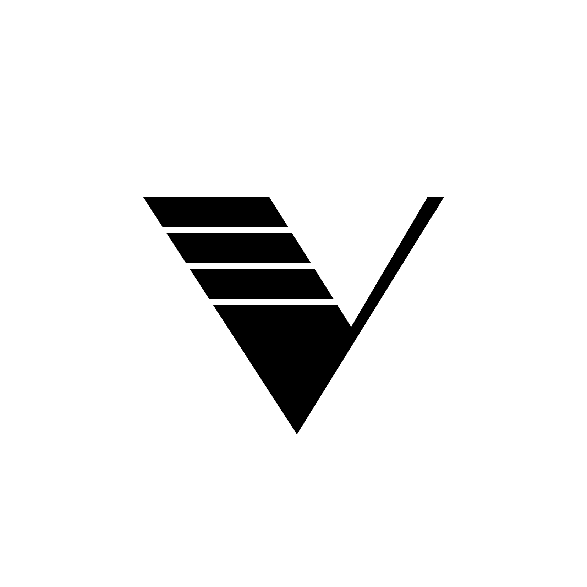

# The Version

The Version is a cross-platform 3D rendering engine.
**Currently Version is not fully-implemented**.

## Getting started
You can clone the repository to a local destination using git:

- `git clone --recursive https://github.com/udv-code/Version`

You may do a `--recursive` clone to fetch all of the submodules.

## The Plan
The plan is to create a 3D cross-platform rendering engine
and learn "the best practices" of game engine development.

That's the matter for development to be very slow and precise.

You can view plans, issues, TODOs and more [here](Plan.md).

### Mentions
Inspired by [TheCherno's](https://github.com/TheCherno) [Hazel](https://github.com/TheCherno/Hazel) videos.
